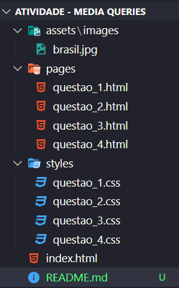

# LABORÁTORIO CSS - PARTE 2

Esta atividade consiste no desenvolvimento de uma série de questões envolvendo unicamente HTML 5 e CSS 3.

## Estrutura da Atividade

Cada questão da atividade foi feita em uma página html diferente, cada uma destas contendo um arquivo de estilização CSS também diferente. A estrutura segue abaixo:

Na pasta **assets** pode ser encontrada a imagem da bandeira do Brasil. Dentro da pasta **pages** estão os arquivos HTML para cada questão. Na pasta **styles** estão os arquivos de estilização de cada página. 

## Como visualizar as páginas

Baixe o projeto em seu PC, salve-o em um diretório e abra com um navegador o arquivo **index.html**, a partir de lá você será direcionado por meio de links às páginas referentes a cada questão.